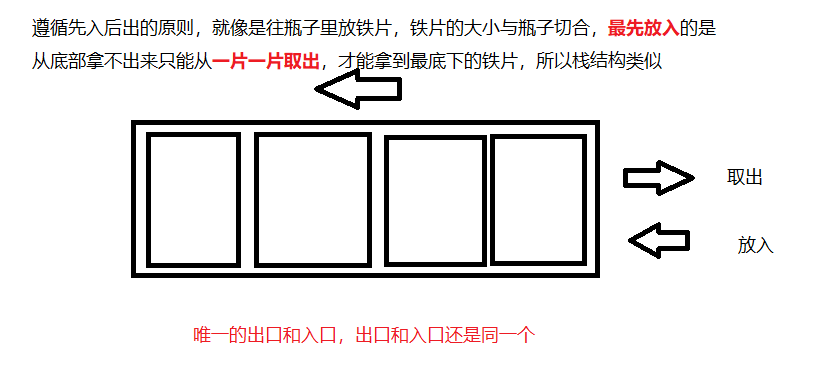

#### 栈
> 栈的特性： 先进后出，层层叠加，不可打乱顺序



#### 代码编写

```js

    class Stack {
        // 储存要现有 一个容器我们定义该容器为 数组
        constructor() {
            this.stack = [];
        }
        // 一个数据结构要有
        // 增加数据的功能
        push(item) {
            // 栈数据结构 就规定从末尾添加
            this.stack.push(item)
        }
        // 删除数据
        pop() {
            // 添加从末尾，只有一个出入口，出入口相同 所以删除最后一个元素
            return this.stack.pop()
        }
        // 栈的长度
        getSize() {
            return this.stack.length
        }
        // 查能最先出的数据
        peek() {
            return this.stack[this.getSize() - 1]
        }
        // 判断是否为空
        isEmpty() {
            return this.getSize() === 0
        }
    }


```


#### 栈的应用
> leetcode 中有一道题目： 判断有效括号， 给定括号 '{' '}'  '[' ']'  '(' ')' 的字符串，判断括号是否有效 <br />
> 1、左括号必须用相同类型的右括号闭合 <br />
> 2、左括号必须以正确的形式闭合

```js

    let isValid = function(s) {
        const map = {
            '(': ')'
            '[': ']'
            '{': '}'
        }
        const stack = new Stack()
        for(item of s) {
            if(map[item]) {
                stack.push(item)
            } else {
                let last = stack.pop()
                if(item !== map[last]) return false
            }
        }
        return stack.getSize() === 0
    }

```

