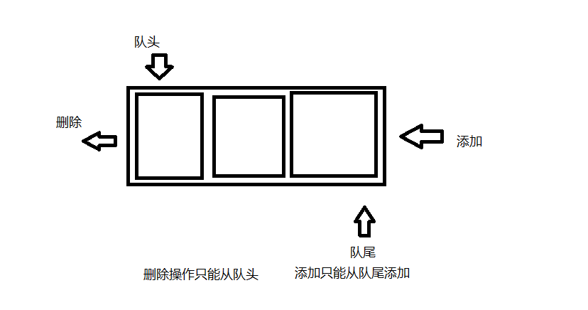

#### 队列
> 队列的特性：先进先出，只允许在表的前端进行删除，称为对头；在表的后端进行添加，成为队尾，不可更改



#### 代码编写

```js
    class Queue {
        constructor() {
            this.queue = [];
        }
        push(item) {
            this.queue.push(item)
        }
        shift() {
            return this.queue.shift()
        }
        getSize() {
            return this.queue.length
        }
        peek() {
            return this.queue[0]
        }
        isEmpty() {
            return this.getSize() === 0
        }
    }

```
